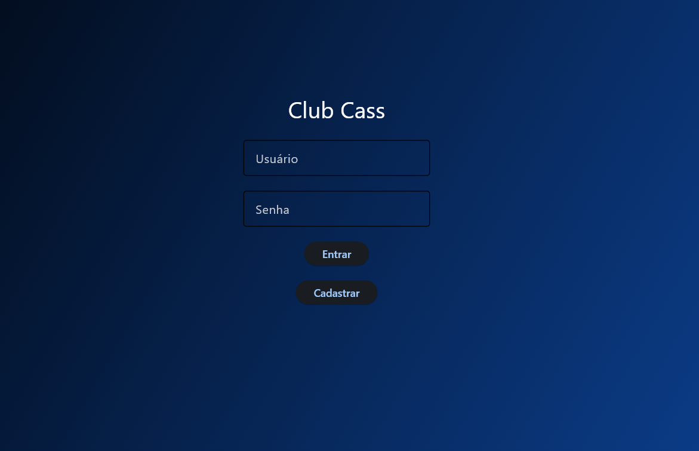
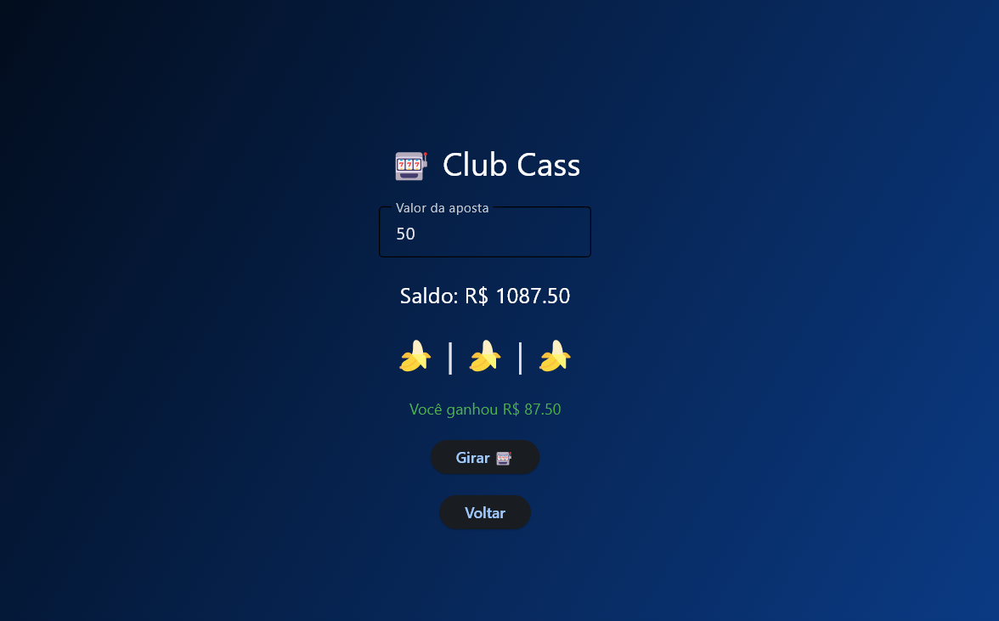

# 🎰 Club Cass

Aplicação com sistema de login, cadastro e jogo de roleta, utilizando Python, SQLite e Flet.

## 🚀 Funcionalidades

- Cadastro de usuários
- Login com verificação de senha
- Sistema de saldo
- Jogo de roleta com apostas
- Atualização de saldo em tempo real

## 🛠️ Tecnologias

- Python
- SQLite
- Flet

## 📚 Aprendizados

Neste projeto pratiquei:

- Criação de CRUD com SQLite
- Integração entre backend e interface
- Manipulação de eventos com Flet
- Lógica de jogo e controle de saldo
- Tratamento de erros e validações

## 👨‍💻 Desenvolvimento

O backend e a lógica principal do sistema foram desenvolvidos por mim.

A interface gráfica e alguns ajustes técnicos contaram com apoio de IA como ferramenta de aprendizado e auxílio durante o desenvolvimento.


## 📸 Preview

### 🔐 Login


### 🎰 Roleta


## ▶️ Como executar

```bash
pip install flet
python app.py

